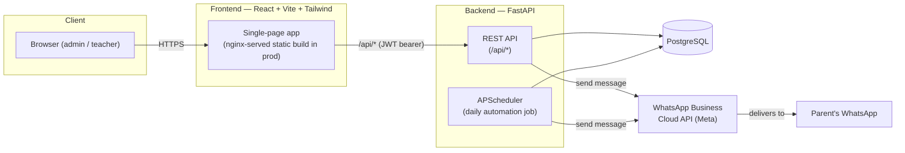
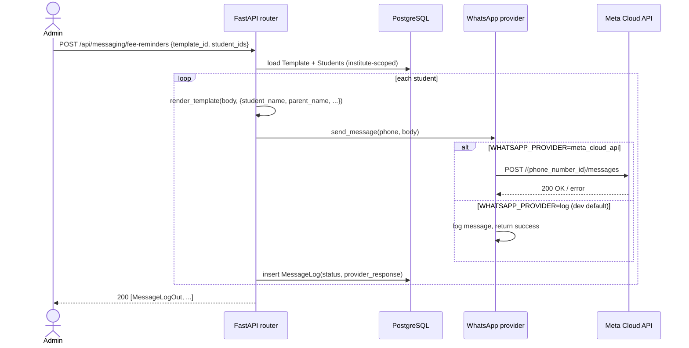
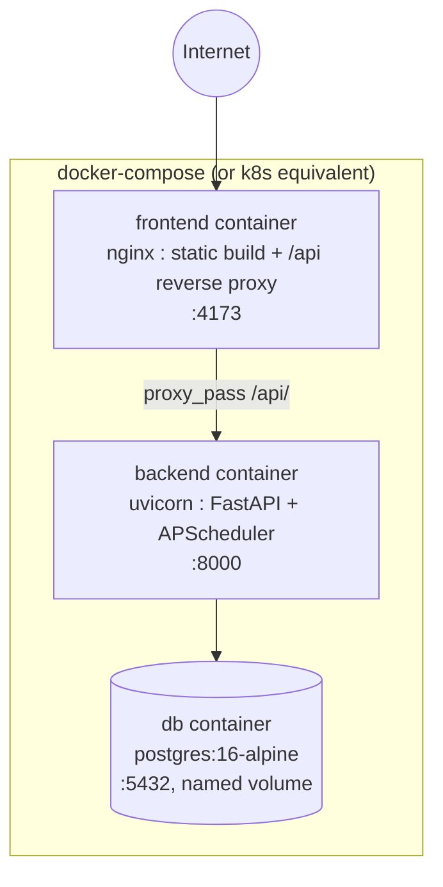

# Architecture — meta-micro

## 1. System overview

meta-micro is a conventional three-tier web app: a React single-page
frontend, a stateless FastAPI backend, and a PostgreSQL database, with an
outbound integration to the WhatsApp Business Cloud API and an in-process
scheduler for recurring jobs.



## 2. Why this stack

| Layer | Choice | Rationale |
|---|---|---|
| Frontend | React + Vite | Fast dev loop, small bundle, ecosystem fit for a form/CRUD-heavy admin app |
| Styling | Tailwind CSS | Encodes the SRD's design tokens (palette, type scale, radius) directly in config, keeps components self-contained |
| i18n | react-i18next | Simple JSON-resource based translation, matches the bilingual (Hindi/English) requirement |
| Backend | FastAPI | Async-capable, typed request/response models via Pydantic, automatic OpenAPI docs at `/docs` |
| ORM | SQLAlchemy 2.0 | Explicit, typed models; works the same against Postgres (prod) and SQLite (quick local/dev) |
| Database | PostgreSQL | Relational integrity for a multi-tenant CRUD-heavy domain; JSON/enum support if needed later |
| Auth | JWT (python-jose) + bcrypt (passlib) | Stateless auth suited to a horizontally-scaled API; no server-side session store needed |
| Scheduling | APScheduler (in-process) | Simple cron-like job for a single-instance MVP; see §7 for the scaling caveat |
| Messaging | Custom provider abstraction | Decouples the app from WhatsApp credentials so dev/demo works with zero external setup |

## 3. Backend architecture

```
backend/app/
├── core/       config (env vars), database (SQLAlchemy session/engine),
│               security (JWT + bcrypt), deps (auth dependencies)
├── models/     SQLAlchemy ORM models — one source of truth for the schema
├── schemas/    Pydantic request/response models — the API's public contract
├── routers/    one FastAPI router per resource; all business logic lives here
├── services/   whatsapp.py (provider abstraction), scheduler.py (automation job)
└── main.py     app factory: wires routers, CORS, lifespan (create tables, start scheduler)
```

This is a deliberately flat, router-per-resource layout rather than a
layered (controller/service/repository) architecture — the domain is
CRUD-shaped and small enough that an extra service layer would add
indirection without paying for itself. `services/` exists specifically
for the two pieces of *real* logic that aren't CRUD: WhatsApp delivery
and scheduled automation.

### Request lifecycle

1. Every authenticated request carries `Authorization: Bearer <JWT>`.
2. `app/core/deps.py::get_current_user` decodes the token, loads the
   `User` row, and injects it into the route handler.
3. Every query in every router filters by
   `<Model>.institute_id == user.institute_id` — this is the entire
   multi-tenancy enforcement mechanism (see §5).
4. `require_admin` is used instead of `get_current_user` on
   admin-only routes (teacher invites, automations config).

### Data flow — sending a WhatsApp message (manual or automated)



The automation path (`services/scheduler.py`) runs the same
render→send→log sequence, triggered by APScheduler once a day, filtered
to `AutomationSetting` rows where `day_of_month == today.day` and
`enabled == true`.

## 4. Frontend architecture

```
frontend/src/
├── api/          axios instance with JWT interceptor (client.js) +
│                 typed endpoint functions grouped by resource (api.js)
├── context/      AuthContext — holds the current user/institute, exposes
│                 login/signup/logout, called once at app root
├── i18n/         i18next setup + en.json/hi.json resource files
├── layouts/      DashboardLayout — sidebar nav + topbar shell for /app/*
├── components/   shared UI: Modal, StatTile, LanguageToggle, Character
│                 (landing illustration), SendMessagePanel (shared by
│                 Fee Reminders & Parent Updates), ProtectedRoute
└── pages/        one file per route (Landing, Login, SignUp, Students,
                  StudentDetails, Batches, BatchDetails, Fees, Attendance,
                  TestScores, Templates, FeeReminders, ParentUpdates,
                  Automations, Setup)
```

- **Routing**: `react-router-dom`, with `/app/*` wrapped in
  `<ProtectedRoute>` which redirects to `/login` if there's no
  authenticated user (checked via `AuthContext`).
- **Auth persistence**: the JWT is stored in `localStorage`
  (`meta_micro_token`); on load, `AuthContext` calls `GET /api/auth/me`
  to hydrate `user` + `institute` state, and applies the institute's
  default language.
- **API calls**: every page imports typed functions from `src/api/api.js`
  (e.g. `studentsApi.list()`) rather than calling axios directly — this
  keeps endpoint paths in one place.
- **Design system**: encoded in `tailwind.config.js` (colors, font
  families, type scale, radius, shadows) per the SRD's palette (cream
  `#FAF3E0` background, coral `#FF6F61` primary, gold `#FFD700` accent)
  and applied via reusable utility classes in `index.css`
  (`.btn-primary`, `.card`, `.input`, etc.).

## 5. Multi-tenancy model

meta-micro uses **shared-schema, row-level multi-tenancy**: one
PostgreSQL database, every tenant-owned table carries an `institute_id`
foreign key, and every router query filters on the authenticated user's
`institute_id`. There is no cross-tenant query path in the API surface —
a user can never pass another institute's ID and get data back, because
the institute ID is derived from the JWT-authenticated user, never from
client-supplied input.

This is the right tradeoff for a micro SaaS at this scale: it avoids the
operational overhead of per-tenant databases/schemas while PostgreSQL's
relational integrity keeps tenant isolation correct and simple to audit
(grep for `institute_id ==` in any router to verify scoping).

## 6. Security model

- **Passwords**: bcrypt via passlib (`app/core/security.py`), never
  stored or logged in plaintext.
- **Tokens**: JWT signed with `JWT_SECRET` (HS256), 7-day expiry by
  default (`ACCESS_TOKEN_EXPIRE_MINUTES`), carrying only the user ID as
  subject — no PII in the token payload.
- **Authorization**: two levels — `get_current_user` (any authenticated
  user in the institute) and `require_admin` (admin role only), applied
  per-route via FastAPI dependencies.
- **CORS**: locked to `CORS_ORIGINS` (env-configured), not wildcarded.
- **Secrets**: `.env` is gitignored; `.env.example` documents required
  vars with no real values committed.

## 7. WhatsApp integration

`app/services/whatsapp.py` defines a `WhatsAppProvider` interface with
two implementations:

- **`LogWhatsAppProvider`** (default, `WHATSAPP_PROVIDER=log`): logs the
  outgoing message instead of sending it. This is what makes the entire
  app — including fee reminders and automations — fully testable and
  demoable without a Meta Business account.
- **`MetaCloudApiProvider`** (`WHATSAPP_PROVIDER=meta_cloud_api`): calls
  Meta's WhatsApp Business Cloud API (`POST
  /{phone_number_id}/messages`) using `WHATSAPP_PHONE_NUMBER_ID` and
  `WHATSAPP_ACCESS_TOKEN`.

Every send — manual or automated — is persisted to `message_logs`
regardless of provider, so delivery history is queryable even in dev.

## 8. Automation / scheduling

`app/services/scheduler.py` starts an in-process `BackgroundScheduler`
(APScheduler) on app startup (`main.py`'s `lifespan`), running a single
cron job daily at 09:00 server time. The job:

1. Loads all `AutomationSetting` rows where `enabled=true` and
   `day_of_month == today.day`.
2. For `fee_reminder` automations, targets every student with a
   non-paid `Fee` row in that institute.
3. For `parent_update` automations, targets every active student in
   that institute.
4. Renders the configured template and sends + logs exactly like a
   manual send.

**Scaling caveat**: an in-process scheduler is correct for a single
backend instance (the MVP's deployment target) but would fire the job
once *per replica* if the backend is horizontally scaled. Moving to a
distributed scheduler (e.g. a dedicated worker + Redis/Celery beat, or a
Postgres-based lock) is a known follow-up before running >1 backend
replica in production.

## 9. Deployment architecture



- **frontend**: multi-stage Dockerfile — `npm run build` in a Node
  stage, then served as static files by nginx, which also reverse-proxies
  `/api/*` to the backend container so the SPA only ever calls
  same-origin relative paths (`/api/...`), no CORS/base-URL wiring needed
  in production.
- **backend**: single-stage Python image running `uvicorn`; `Base.
  metadata.create_all()` runs at startup for MVP simplicity (no Alembic
  migration step yet — see §10).
- **db**: stock `postgres:16-alpine` with a named volume for
  persistence and a healthcheck gating backend startup.
- Kubernetes is a documented option in the SRD's tech stack for scaling
  beyond docker-compose; the same three containers map directly to three
  Deployments + a StatefulSet (or managed Postgres) behind a Service/Ingress.

## 10. Known technical debt / follow-ups

- **Migrations**: schema is created via `Base.metadata.create_all()` at
  startup rather than Alembic migrations. Fine for MVP; needed before
  any schema change against a production database with real data.
- **Scheduler scaling**: see §8 — needs a distributed scheduler before
  running multiple backend replicas.
- **Rate limiting**: no rate limiting on auth or messaging endpoints yet;
  worth adding before public exposure (especially `/api/auth/login` and
  bulk-send endpoints).
- **Bulk student import UI**: the backend endpoint
  (`POST /api/setup/import-students`) exists but has no frontend form
  yet — students are added one at a time in the current UI.
