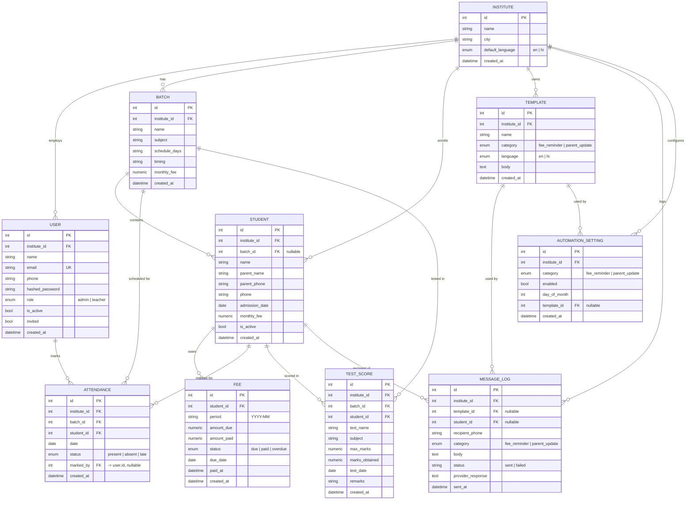

# Data Model — meta-micro

Source of truth: `backend/app/models/models.py` (SQLAlchemy 2.0
declarative models). This document is a readable companion to that file,
not a replacement for it.

## Entity-relationship diagram

## Table notes

### `institutes`
The tenant root. Every other tenant-owned table hangs off
`institute_id`, directly or transitively. `default_language` seeds the
UI language shown to that institute's users on first load.

### `users`
Holds both personas — `role` distinguishes `admin` from `teacher`.
`email` is globally unique (not just per-institute) since it's the
login identifier. `invited` flags teacher accounts created via the
admin-invite flow (`POST /api/auth/teachers/invite`) rather than
self-signup — only admins can self-signup (which creates the institute
in the same transaction; see `POST /api/auth/signup`).

### `batches`
A class/section grouping. `monthly_fee` here is a *default* — actual
billing happens per-student via `fees`, and a student's own
`monthly_fee` can differ from the batch default (e.g. a scholarship
student).

### `students`
`batch_id` is nullable — a student can exist unassigned to a batch
(e.g. mid-enrollment). `parent_phone` is the primary WhatsApp recipient
for fee reminders and parent updates; `phone` (the student's own number)
is used as a fallback when `parent_phone` is absent.

### `fees`
One row per student per billing `period` (`"YYYY-MM"` string, not a
date column — billing periods are calendar months, not arbitrary
ranges). Unique constraint on `(student_id, period)` prevents duplicate
billing for the same month. `status` is set explicitly by the app
(`due` → `paid` on `POST /fees/{id}/mark-paid`); there's no automatic
`due` → `overdue` transition job in the current implementation — the
`overdue` state exists in the schema/UI but must be set manually today
(a candidate for a small nightly job, see Architecture doc §10).

### `attendance`
Unique constraint on `(student_id, date)` — one attendance record per
student per day, upserted by `POST /api/attendance` (submitting the
same batch+date again updates existing rows rather than duplicating
them). `marked_by` records which user (typically a teacher) submitted
it.

### `test_scores`
No uniqueness constraint — a student can have multiple score rows for
the same test if entered twice (an acceptable simplification for MVP;
the report endpoint aggregates by summing, so duplicate entries would
double-count — front-end doesn't currently guard against resubmission).

### `templates`
`category` + `language` together determine which templates are offered
where: the Fee Reminders and Parent Updates send pages only list
templates matching their category; either page lets the admin pick any
language variant available.

### `message_logs`
An append-only audit trail of every WhatsApp send attempt — manual or
automated — with the rendered message body (post-placeholder
substitution) and the provider's raw response for debugging delivery
issues. `template_id` and `student_id` are nullable so a log row
survives even if the referenced template or student is later deleted.

### `automation_settings`
One row per `(institute_id, category)` — an institute has at most one
fee-reminder automation and one parent-update automation configured at
a time (enforced by a unique constraint). `day_of_month` is a plain
integer (1–28, validated in the frontend to avoid month-length edge
cases); the scheduler job checks `day_of_month == today.day` once daily.

## Enums

| Enum | Values | Used by |
|---|---|---|
| `UserRole` | `admin`, `teacher` | `users.role` |
| `FeeStatus` | `due`, `paid`, `overdue` | `fees.status` |
| `AttendanceStatus` | `present`, `absent`, `late` | `attendance.status` |
| `TemplateCategory` | `fee_reminder`, `parent_update` | `templates.category`, `message_logs.category`, `automation_settings.category` |
| `Language` | `en`, `hi` | `institutes.default_language`, `templates.language` |

## Cascade behavior

- Deleting an `Institute` cascades to its `users`, `batches`,
  `students`, and `templates` (`cascade="all, delete-orphan"` on those
  relationships) — there is no institute-delete endpoint exposed today,
  but the cascade is in place for when one is added.
- Deleting a `Student` cascades to their `fees`, `attendance_records`,
  and `test_scores`.
- Deleting a `Batch` does **not** cascade to its students —
  `Student.batch_id` is simply left dangling as `NULL` implicitly by the
  FK (students are unassigned, not deleted), matching the "Students in
  this batch" empty-state the frontend already handles.
